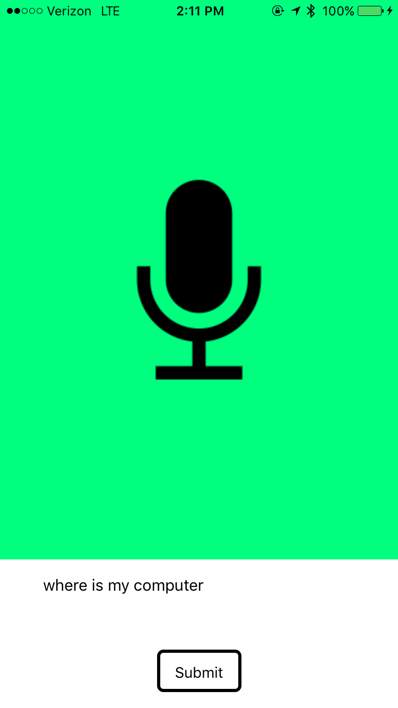
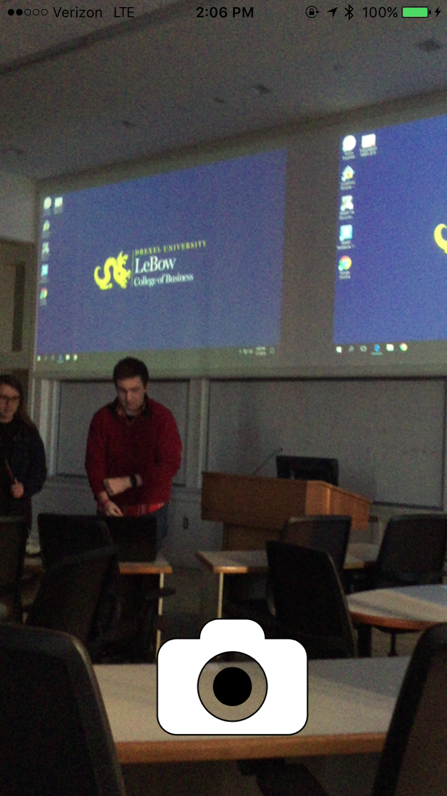
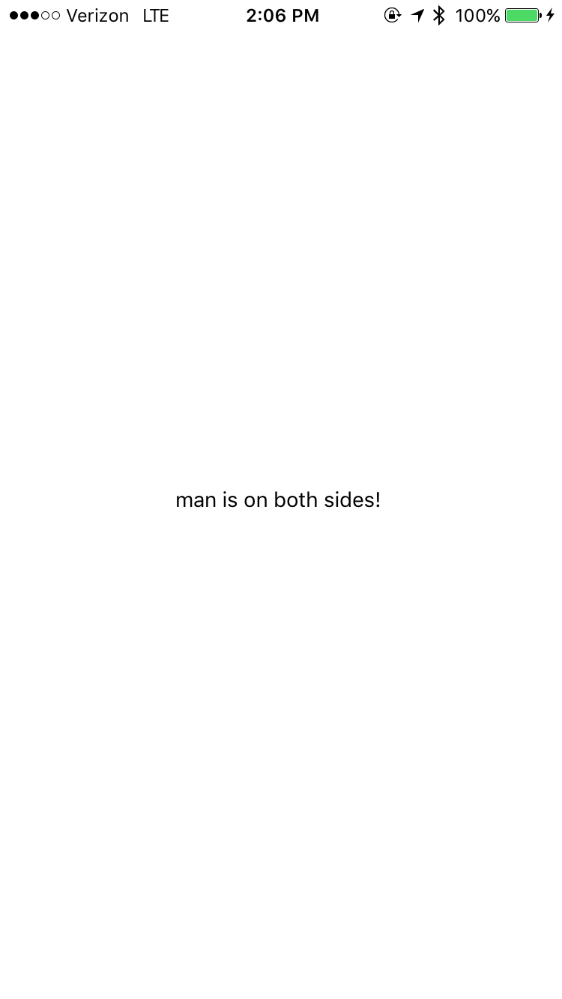

## Image Recognition App

### Submission for Dragon Hacks 2018

#### Inspiration
Today, 6.5 million Americans over the age of 65 have a severe visual impairment and this is a problem that a few of our teammates hold near and dear to our hearts. We saw that there lacks options available and wanted to know, "How could we make a tool that improves quality of life while introducing as little complexity as possible?" Furthermore, with close to 60% of elderly and 92% of Americans having cell phones it makes for the perfect tool to empower the visually impaired.

#### What it does
The app utilizes the front facing camera and a minimalistic UI to analyze a room, then providing feedback reguarding the surroundings. Furthermore, by enabling the user to use voice commands they can interact through a much easier mean and find out important information. Some features include being able to tell which side of the room and item of interest is on, and describing the general surroundings.

#### How we built it
The app is built on a React Native core allowing us to instantly have a cross platform tool working for both iOS and Android. (Despite none of us owning an android device) It then uses microsoft's azure computer vision API to tag different quadrants of the image and analyze for what objects preside. Furthermore, we used the phones default voice to text API's for analyzing what the user has spoken to then correspond it to a command.

#### Challenges we ran into
We initially built out a TensorFlow model that would do object detection but learned that the latency associated was too high for it to be valuable. We also we discovered many of the per-trained models we wanted to use lacked many of the common house-hold objects we saw as important.

#### What we learned
We learned a lot about machine learning and how to build a decent model. Some of our team members gained knowledge on React Native and how to build a complex app using the platform.

#### Plans for the Future
Our hopes is to actually move to our own Machine Learning model that is trained with house hold objects and with a server that utilizes CUDA cores. Consequently, by using a more specific type of object detection we could provide more specific instructions on how to navigate a room. Finally, we desire to bundle the sensors into a more compact contraption.

#### Additional Screenshots

